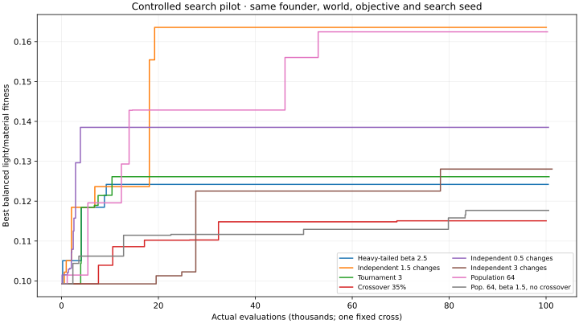
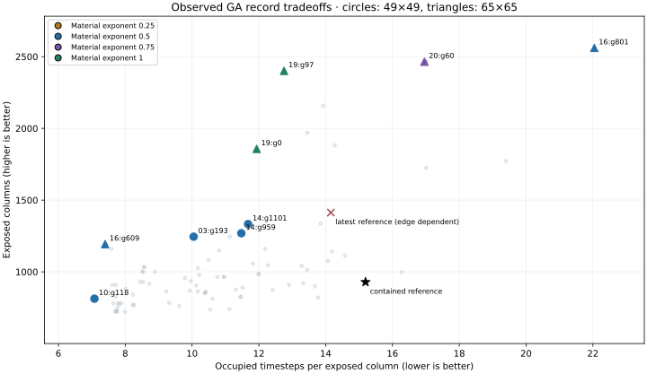
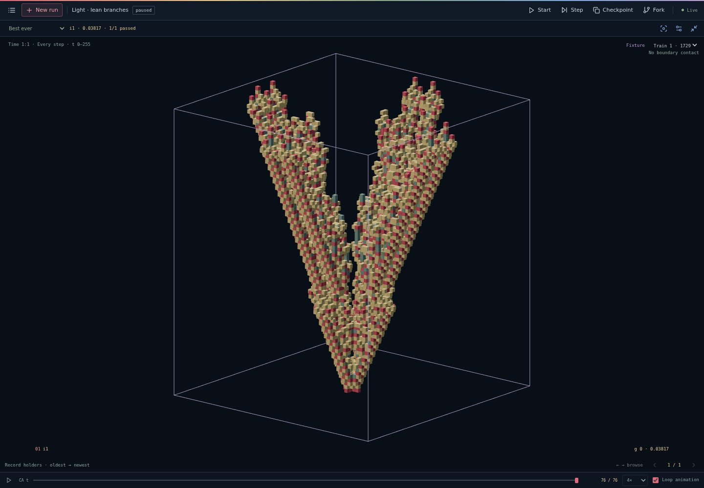
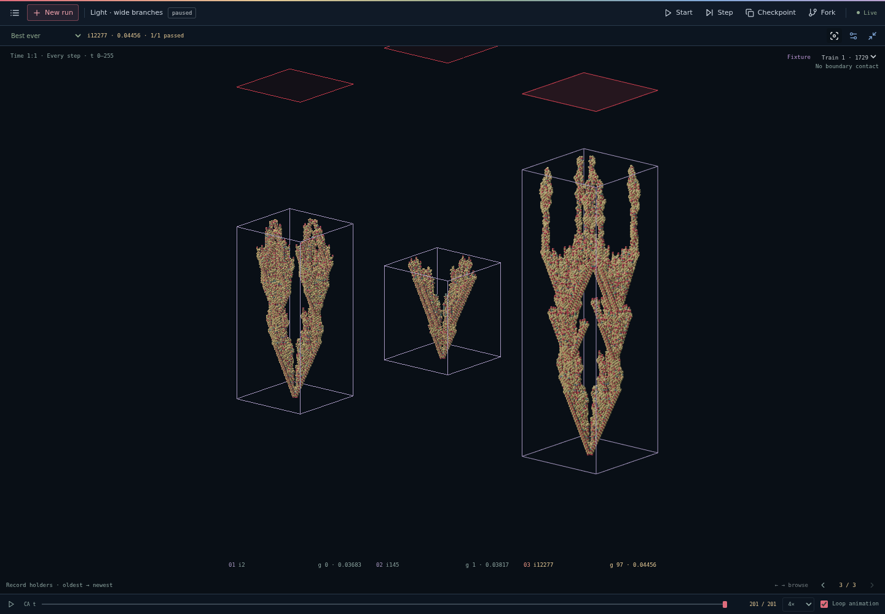

# Light-area GA tuning · 9 September 2026

**Completed.** Three-hour session scheduled for 13:55:03–16:55:03 UTC. The task was to evolve useful light-exposed area without rewarding repeated stacks of cells, using the latest public checkpoint as a reference and keeping the cross starting pattern.

The selected results are saved on the public site:

| Run | World | Exposed columns | Occupied cell-timesteps | Mean stacking |
| --- | --- | ---: | ---: | ---: |
| [Light · lean branches](https://polyp.observer/api/runs/8dbe22ce-1404-4287-a9a9-a4bed6e977c9/checkpoint) | 65 × 65 | 1,193 | 8,826 | 7.40 |
| [Light · wide branches](https://polyp.observer/api/runs/bdcfbbb7-699d-497d-896f-44091886d027/checkpoint) | 65 × 65 | 2,401 | 30,622 | 12.75 |

All experimental candidates were produced by the unchanged native GA, pinned at commit `30d786caa6d04d044c5c1eea45e67a728037034b`. Changes were to objectives, search settings, world size and explicit intact founders copied from previous GA results. No hand-designed or edited genome was injected. An early offline mutation diagnostic preceded the user's clarification; it supplied no injected candidates and was discontinued.

The campaign recorded 24 initialized trials and 2,225,627 actual fixture evaluations. Budgets varied by phase, as detailed below; cache hits are not counted as evaluations.

## What the objective was getting wrong

The reference combined exposed area with a persistence reward. Persistence pays for extra occupied timesteps, including repeated occupation of the same columns. Its reuse-after-death penalty also misses uninterrupted occupation and becomes negligible at large counts.

Let **U** be distinct X/Z columns ever occupied, **T** the total number of occupied cell-timesteps, and **A** the world area. The experiments used:

`(U / A) × (U / max(1, T))^alpha`

Here **T/U** is mean stacking. At fixed exposed area, extra occupied cells always reduce fitness. No persistence bonus is added. The expressions use the existing formula editor; no new optimizer or genetic operator was required.

This measures light from directly overhead: one exposed cell per occupied X/Z column. It does not model side lighting or count every exposed voxel face.

The initial alpha=0.5 penalty improved the reference, but became too forgiving in a larger arena. One new record increased exposed columns from 1,969 to 2,561 while increasing material from 26,482 to 56,450: only a 1.6% score gain, despite more than doubling material. Alpha=1 rejects this tradeoff. Alpha=0.75 was added as an intermediate, explicitly recorded objective trial. Each objective change starts a new run; old fitness histories are retained unchanged.

For alpha=1 the exact expression is:

`exposedCells / area * exposedCells / max(1, totalCells)`

The configured custom incentive replaces the legacy objective and weights. Those legacy fields remain in the immutable checkpoint schema, but do not add a longevity reward to this formula.

## Controlled search evidence

The common task was five states, a 49×49 world, 128 timesteps, one deterministic cross and an intact contained ancestor from generation 338 of the reference checkpoint. Both spatial contact and survival to the horizon disqualify a candidate. The latest reference champion touched the small world's edges and changed behavior in larger worlds, so it was retained as context rather than treated as a naturally finite founder.

The most useful baseline used population 128, two distinct elites, tournament 2, independent mutation with an expected 1.5 changed outputs per child (probability 1.5/44 per mutable output), no crossover and 5% sparse random immigrants. Every genotype receives the same cross. Extra numeric cross seeds create duplicate worlds, so these trials used one training fixture and no duplicate held-out fixtures.

Three search-RNG repeats of that baseline, at approximately 100,000 actual fixture evaluations each, produced 1,081–1,245 exposed columns, compared with 929 for the contained founder. Mean stacking was 10.05–10.81, compared with 15.19. The median balanced fitness was 0.14557. All three improved both exposed area and mean stacking.

On the shared pilot search seed, the independent 1.5-change baseline outperformed heavy-tailed beta 2.5, independent 0.5 and 3 changes, tournament 3, and 35% crossover. Population 64 was nearly tied in balanced fitness but traded more area for more material. These are small, task-specific pilots, not universal default recommendations.

The final configuration audit caught a setup error in study 15: it was named “current search defaults,” but retained `crossover: none`. Its configured 70% rate was therefore inactive. The result tests population 64 with heavy-tailed beta 1.5 and no crossover; it cannot establish how the actual current preset performs. Study 24 corrects this by explicitly copying all native search settings, including uniform crossover, while keeping the controlled founder, objective, world and search seed. It stopped at 20,672 evaluations against a 20,000-evaluation target, reaching 929 exposed columns at 15.19 mean stacking. Targets are checked between complete generations at ten-second intervals, so actual totals can slightly exceed the target. This short corrective trial is not compared against the other trials' 100,000-evaluation endpoints. The original trial and its configuration remain available.

Two independently randomized initial populations also ran, without inserted founders. They found different forms but did not overtake the reference-derived runs within their 150,000-evaluation budgets. That is not a fair comparison of total discovery cost: the inherited founder already embodies earlier evolutionary work.

Plateaus remained. The strongest original baseline found its record around 19,216 evaluations and did not improve by 100,054; other trials made useful gains much later. The baseline still had 30 distinct genomes among its top 32 at the final checkpoint, so a flat curve was not simply a population of exact clones. No post-clarification neighborhood enumeration was used to claim strict local optimality.

## Adaptive discovery and validation

Later runs moved two intact GA lineages to 65×65 worlds with 256 timesteps. They compare actual area and material, not normalized fitness across different world sizes. The larger arena enabled naturally finite forms that a 49-cell box would clip and alter.

The two exploratory runs using square-root material cost were stopped early at 90,589 and 66,766 evaluations when the objective began accepting excessive bulk. Their planned 200,000 budgets and the reason for stopping are retained in the campaign log. Compute moved to stronger-cost trials. Those targets were subsequently set to 100,000 to reserve time for intermediate-cost repeats before the fixed deadline. All actual budgets are listed below; these later decisions are adaptive tuning, not a preregistered equal-budget benchmark.

The two alpha=0.75 repeats both finished approximately 100,000 evaluations and reached the same measured form: 2,157 exposed columns, 30,034 occupied cell-timesteps and 13.92 mean stacking. The best alpha=1 result achieved more exposed area and lower mean stacking. This supports retaining the stronger penalty for the saved recipe, while keeping the intermediate trials for inspection.

The three alpha=1 searches from the same intact broad founder were also compared using their last complete generation at or below 50,000 evaluations. Only the search RNG differs. This compares study 19's 50,000-evaluation prefix with studies 22 and 23, rather than giving study 19 credit for its longer final budget.

| Study | Search seed | Compared evaluations | Exposed columns | Mean stacking | Reached 50,000 total evaluations? |
| --- | ---: | ---: | ---: | ---: | --- |
| 19 | 9090419 | 49,969 | 2,401 | 12.75 | Yes |
| 22 | 9090421 | 49,974 | 1,193 | 7.40 | Yes |
| 23 | 9090422 | 49,923 | 1,193 | 7.40 | Yes |

1 of these three searches reached at least 2,000 exposed columns within the comparison budget. This small sample shows why the best saved individual should not be confused with reliable convergence or a cure for plateaus.

Captured champion scores were replayed with a frozen evaluator from the runner's commit. Finalist checks compare every occupied cell and state, centered in worlds 97×97×512 and 129×129×2,048, as well as exposed area, total material, lifespan and boundary contacts. Matching complete geometry rules out a finite-box or short-horizon explanation for those finalists; the [measurements and geometry hashes](finalist-validation.json) are included. This is a boundary-artifact check, not evidence of generalization to random soups.

The plot shows observed improvement records, not an exhaustive Pareto search. Highlighted records are nondominated among the recorded forms with at least 721 exposed columns. Earlier useful forms remain in the runs' galleries even when a later scalar record replaces them. The latest reference marker is edge dependent and is excluded from the feasible tradeoff set.

## Preserved results

- **Light · lean branches**: [checkpoint](https://polyp.observer/api/runs/8dbe22ce-1404-4287-a9a9-a4bed6e977c9/checkpoint), generation 1,018. Published paused with 13 evaluation workers configured for resumption.
- **Light · wide branches**: [checkpoint](https://polyp.observer/api/runs/bdcfbbb7-699d-497d-896f-44091886d027/checkpoint), generation 1,016. Published paused with 13 evaluation workers configured for resumption.

The lean form was first evolved in study 16 at generation 609. Study 18 retained that intact founder through its 100,467-evaluation stronger-cost trial without further improvement.

Both screenshots show the complete occupied history from the same cross. The wide run's gallery includes its earlier records, with the final result at right. Each viewer fits its scene to the screen, so image height is not a shared physical scale between screenshots.

Publication changes the run name and resource allocation only. The import is checked for exact preservation of population, RNG state, counters, history and improvement records. The original public and dev jobs are not changed by publication. The public site already has a 13-evaluator limit.

| Study | World × timesteps | Actual evaluations | Exposed columns | Occupied cell-timesteps | Mean stacking | Lifetime |
| --- | --- | ---: | ---: | ---: | ---: | ---: |
| 01 · efficient footprint | 49 × 49 × 128 | 36,005 | 2,013 | 20,602 | 10.23 | 103 |
| 02 · contained branches | 49 × 49 × 128 | 100,460 | 1,045 | 12,830 | 12.28 | 122 |
| 03 · independent mutation | 49 × 49 × 128 | 100,054 | 1,245 | 12,510 | 10.05 | 84 |
| 04 · tournament three | 49 × 49 × 128 | 100,623 | 1,141 | 16,194 | 14.19 | 88 |
| 05 · moderate crossover | 49 × 49 × 128 | 100,029 | 1,013 | 13,618 | 13.44 | 122 |
| 06 · half an edit | 49 × 49 × 128 | 100,501 | 1,161 | 14,150 | 12.19 | 112 |
| 07 · three edits | 49 × 49 × 128 | 101,243 | 1,057 | 12,494 | 11.82 | 109 |
| 08 · gentler material penalty | 49 × 49 × 128 | 100,271 | 1,033 | 8,850 | 8.57 | 86 |
| 09 · stronger material penalty | 49 × 49 × 128 | 101,531 | 1,245 | 12,510 | 10.05 | 84 |
| 10 · baseline repeat B | 49 × 49 × 128 | 100,267 | 1,149 | 12,418 | 10.81 | 98 |
| 11 · baseline repeat C | 49 × 49 × 128 | 101,486 | 1,081 | 11,342 | 10.49 | 85 |
| 12 · random start A | 49 × 49 × 128 | 150,756 | 469 | 1,515 | 3.23 | 35 |
| 13 · random start B | 49 × 49 × 128 | 150,841 | 741 | 8,235 | 11.11 | 83 |
| 14 · smaller population | 49 × 49 × 128 | 100,301 | 1,333 | 15,566 | 11.68 | 123 |
| 15 · beta 1.5, no crossover (setup error) | 49 × 49 × 128 | 100,535 | 781 | 5,966 | 7.64 | 61 |
| 16 · wider world, broad lineage | 65 × 65 × 256 | 90,589 | 2,561 | 56,450 | 22.04 | 211 |
| 17 · wider world, thin lineage | 65 × 65 × 256 | 66,766 | 1,881 | 26,838 | 14.27 | 216 |
| 18 · stronger cost, thin record | 65 × 65 × 256 | 100,467 | 1,193 | 8,826 | 7.40 | 77 |
| 19 · stronger cost, wide record | 65 × 65 × 256 | 100,528 | 2,401 | 30,622 | 12.75 | 202 |
| 20 · intermediate cost A | 65 × 65 × 256 | 100,439 | 2,157 | 30,034 | 13.92 | 158 |
| 21 · intermediate cost B | 65 × 65 × 256 | 100,091 | 2,157 | 30,034 | 13.92 | 158 |
| 22 · strict cost repeat B | 65 × 65 × 256 | 50,652 | 1,193 | 8,826 | 7.40 | 77 |
| 23 · strict cost repeat C | 65 × 65 × 256 | 50,520 | 1,193 | 8,826 | 7.40 | 77 |
| 24 · corrected search preset | 49 × 49 × 128 | 20,672 | 929 | 14,114 | 15.19 | 121 |

Study 01 was an early edge-dependent control and is not a robust finalist. Fitness values are deliberately omitted from this cross-objective table. Run names describe the experiment, not necessarily the final morphology.

Full configurations, checkpoints, per-generation progress, objective calibration, source hashes, lineage records, geometry checks and browser artifacts are retained under `.polyp/light-campaign/` in the workspace. Selected full checkpoints are linked above. The compact results table is also exported as [CSV](results.csv), with [all experimental configurations](experiment-configs.json) and the [strict-cost repeat comparison](strict-cost-repeats.json). Literature and the earlier code audit are in [the GA strategy review](../ga-strategy-review.md).

The primary limitations are the small number of repeats, adaptive choices, inherited-founder information, and the fixed cross. The data support these saved recipes for this task; they do not establish globally optimal hyperparameters or soup-robust genes.
